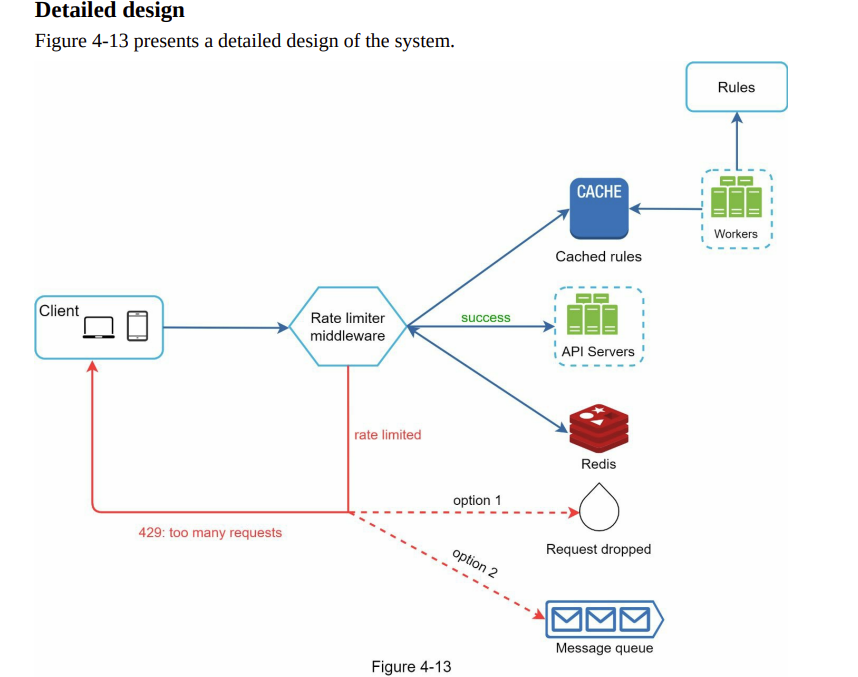

# Rate limiter
Requirementi:
- Client vs Server side? Server side
- Dio API servera ili middleware (API Gateway)
- **Throttle** API requests na osnovu IP-a ili Used ID-a
- Da li sistem radi u distribuiranom okruzenju?
- Pouzdanost - ako rate limmiter fail-uje ne treba citav sistem da bude blokiran

High level design:
- Procijeniti technology stack - **programski jezik**, **chache service**. Mozda je jeftinije uzeti gotovo rjesenje za API gatewaty.


Rate limiting algoritimi:
- T**oken bucket algorithm** - Kofa koja se puni tokenima od n / min, korisnici uzimaju token iz kofe, ako ima tokena mogu da pristupe, ako nema salje se 429 korisniku. **Kofa po korisniku i API-u koji je ogranicen** ako je ogranicenje za API po korisniku. Ako je ogranicenje da odredjenom API-u moze da se pristupi neki broj puta (nezavisno od korisnika) onda **jedna kofa za taj API**.
- **Leaking bucket algorithm** - koristi se queue odrednje velicine za request-ove. Ako je queue pun request se **drop**-uje.
- **Fixed window counter** - vremenski intervali fiksne velicine i counter-i dodijeljeni svakom intervalu. Problem - spike-ovi na granicama intervala.
- **Sliding window log algorithm** - log u koji se upisuju request-ovi sa timestamp-ovima, i izbacuju oni koji su ispadaju iz intervala.
- **Sliding window counter algorithm** - Kao fixed window counter, samo sto se radi srednja vrijednost requst-ova izmedju 2 intervala, proporcionalno proteklom vremenu 2 intervala. Pa onda imas kao sliding window.

High level design:
```
Klijent -> API gateway / Rate Limiter middleware  -> API servers
                                                 <-> Redis
```

Konacan design:


Za distribuirani sistem:
- Sinhronizacioni problemi - counteri moraju biti up to date
- Rjesava se tako sto se koristi centralizovana baza / cache - npr redis


# Chat system
- Klijenti ne komuniciraju direktno - ide preko **chat servera**
- Polling
- WebSocket najbolji za primjenu
- Chat server je **statefull** - drzi otvorene konekcije ka klijentima
- **Stateless** su ostali servisi - Service Discovery, Auth, Group Mangement, ...
- **Push notifications** (third party) - razliciti za IOS, Android
- **SQL DB** za korisnicke podatke, **KV store** za poruke
- 1-1 chat, group chat
- Unique ID genration
- Service Discovery - Zookeper npr. pronalazi najbolji chat server za korisnika da se poveze na njega
- Message sync across multiple devices
- Small group chat - **svaki korisnik** ima svoj **message queue** (kao inbox)
- Presence status - hartbeat