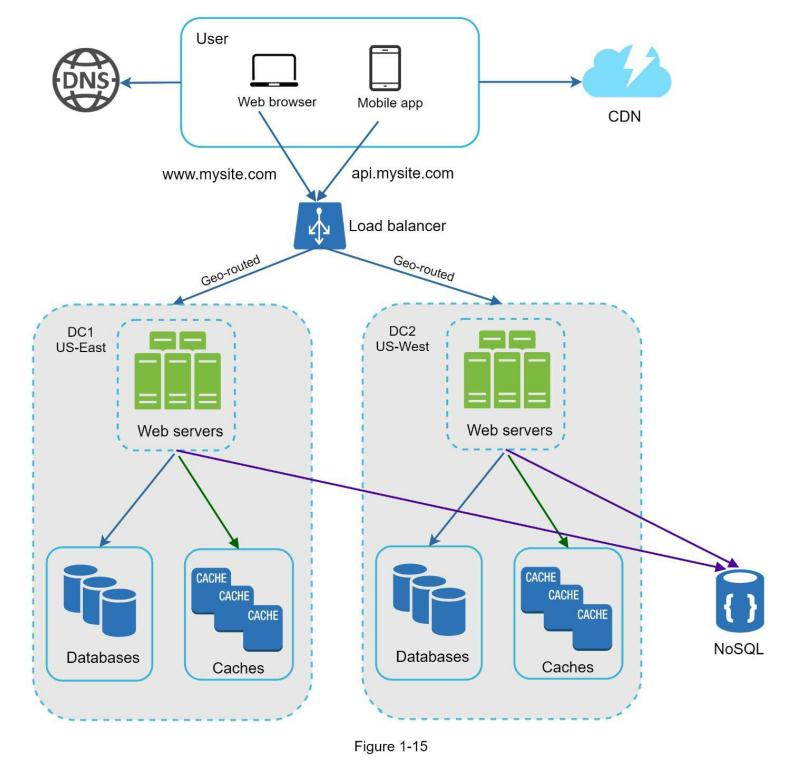
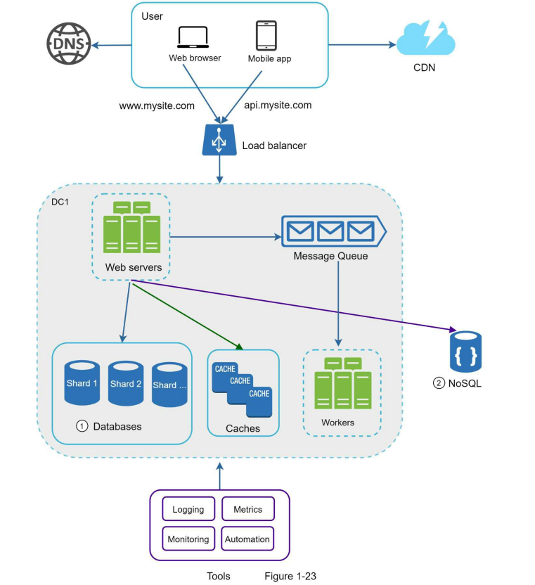
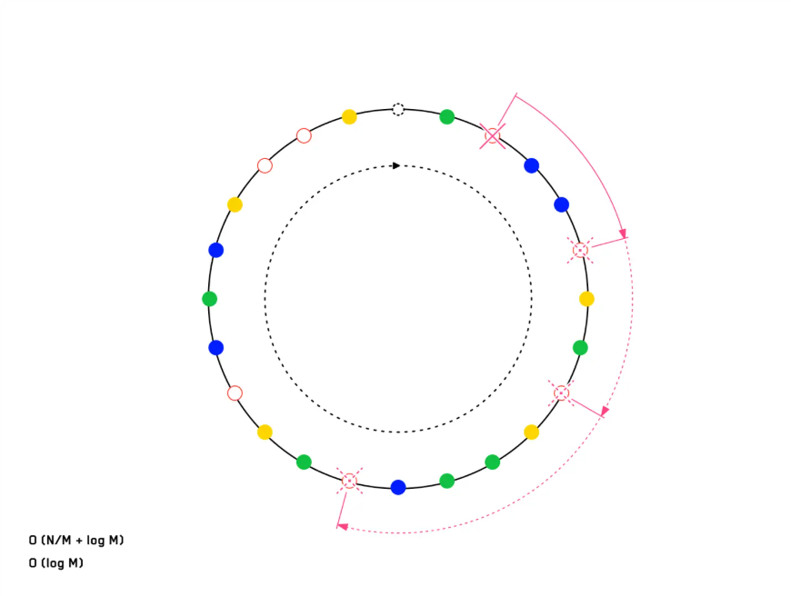

# System design
Krecemo od arhitekture da opsluzujemo jednog korisnika pa je razvijamo do toga da podrzimo milione.

### Cache
- Cache koristiti za podatke koji se **cesto citaju a rijetko mijenjaju**
- Postavljati **expiration date** za cache-irane podatke
- **Consitency** da su podaci u bazi azurni sa podacima u cache
- Cache server? Single point of failure (SPOF)
- Eviction policy Lest Recently Used (LRU), Least Frequrntly Used (LFU), First in First Out (FIFO) - kako izbacivati stvari iz cache-a kad se napuni

### Content Delivery Network (CDN)
- Geo pozicionirani serveri zbog brzeg pristupa za sluzenje statickog sadrzaja (JS, CSS, Image, Video)
- Fajlovi imaju Time To Live (TTL) na CDN-u. Ako TTL istekne, fajl se dohvata sa servera
- Fallback - ako CDN prestane da radi aplikacija mora da nastavi da funkcionise

### Stateless Web Tier
- Horizontalno skaliranje web tier-a (web / applicaiton servers)
- Stateful je kada imas mapiranje klijenata na odredjeni server. Problem je prilikom dodavanja ili uklanjanja servera. Postize se koriscenjem **sticky session**-a u load balancer-u
- Cuvanje **session data** (podataka) van web tier-a, npr u nerelacionoj bazi podataka.
- U stateless arhitekturi klijent zahtjev moze da posalje zahtjev na bilo koji web server

### HTTP polling
- short polling - konekcija se zatvara nakon svakog zahtjeva
- long polling - klijent zadrazava konekciju dok konkecija ne time-out-uje ili dok se ne pojavi nova poruka

### Data centers
- **Geo DNS**  rasporedjuje sadrzaj na osnovu lokacije korisnika ka najblizem data centru
- Replikacija podata izmedju data centara - korisnik bi trebalo da vidi iste podatke bez obzira kom data centru pristupa. Primjer Netflix-a - **asynchronous multi data center replicaiton**

### Message queue
Durable component stored in memory. Producer-i salju poruke, a consumeri uzimaju poruke i obradjuju ih. Korisno kada imas neke zadatke koji se dugo obradjuju - npr obrada videa.

### Logging, metrics, automation

### Database scaling
- Vertical i Horizontal
- **Sharding** - velika baza se dijeli. Svaki shard sadrzi dio podataka - sadrzi sve tabele?, samo dio redova.
- **Resharding** - particiniosanje pojedinacnog shard-a zbog popunjenosti podacima, ili zbog prevelikog opterecenja - **Celebrity problem**
- **Join and de-normalizaiton** kada je baza shard-ovana jako je tesko izvesti Join-ove. Moguce je uraditi de-normalizaciju baze tako da se odredjeni podaci cuvaju u istoj tabeli. A takodje je moguce koristi NoSQL da se ne-relacioni podaci izbace tamo radi brzeg pristupa.

# interviewing.io
## SQL vs NoSQL
### SQL prednosti nad NoSQL:
- **Query language** je bolji, ne mora da se pise custom code i bolje je optimiziovan
- **ACID** daje bolji **up to date info**. SQL baze imaju bolje ACID funkcionalnosti
  - Atomicity -  operacije izvrsavaju atomicno, nema prekidanja
  - Consistency - kada se obavlja write ostale operacije cekaju, NoSQL ima **eventual consistency** - podaci mogu da budu stale i da budu up to date nakon odredjenog broja sekundi
  - Isolation - sve operacije u **transakciji** moraju da se obave bez da ih prekine neka druga transakcija / operacija
  - Durability - u slucaju neuspjeha transakcije podaci mogu da se recover-uju
- B-Trees u SQL bazama su sporiji od **?onoga?** sto NoSQL koristi
- Lakse je dodati polje u NoSQL bazu nego u SQL. SQL zahtjeva migracione skripte itd.

### Performance
- When a write operation occurs, it needs to **overwrite existing values**. This becomes an issue with SSDs since an SSD must erase and rewrite **fairly large blocks** of storage chip at a time. When new pages are created and data is moved, this causes the operation to perform poorly when compared to NoSQL databases that use a **log structure** that only **appends** existing data
- For customer experiences that **do not require strong consistency**, SQL databases will have much **higher latency** compared with NoSQL databases. This is because strong consistency requires that the database **lock particular fields** when it is being modified.

### Tipovi NoSQL baza:
- Key Value - podaci imaju jedinstvene kljuceve a sdrzaj moze da bude bilo sta?
- Document databases - mogu da rade **aggregate searches across data**? Mogu da cuvaju podatke u raznim formatima JSON, XML, YAML
- Columnar databases - koriste tabele, dozvoljavaju denormalziaciju, indexi se rade na kolonama umjesto redovima?
- Graph databases - podatke organizuju u grafove  (facebook npr cini mi se iz one druge knjige)

### Prednosti NoSQL baza
- Brze za upis, sporije za Query
- Log-structured merge tree (LSMT)
- Managed services like DynamoDB and MongoDB come with sharding and scaling out of the box

## Scaling
- Vertical vs Horizontal scaling
- Sharding (db scaling)
- Compute scaling - message queue and processors

## CAP Theorem
- (C)onsistency means that every node in a network will have access to the same data.
- (A)vailability means that the system is always available to the users.
- (P)artition tolerance means that in case of a fault in the network or communication, the system will still work.
- Nemoguce je postici sva 3 odjednom, 2 max - trade offs
- (CA) system ne moze da postoji, jer svi sitemi moraju da tolerisu (P)artition

## Web authentication and basic security
### Cookies
Setting the **"Secure"** flag on a cookie tells the browser only to include it in HTTPS requests, keeping it out of unencrypted traffic that could be intercepted. The **HttpOnly** flag tells the browser not to allow access to the cookie through JavaScript. The cookie will still be sent in request headers, but snooping frontend code won't have direct access to it. The "SameSite" flag allows you to specify the degree of caution the browser should take when sending requests that originate from a different site, to help prevent cross-site request forgery (CSRF) attacks.

### Authentication overview
1. The user **signs up**. At this point, we need to **salt and hash** their password and store those values (but not the password itself!).
2. The user **logs in** with their username and password. We verify the password by **hashing it with the stored salt** and checking to see if it matches the **stored hash** (ideally using a secure library to make the comparison). We then send some kind of identifying token, either a simple session token or a JWT or similar token, back to the client in a **cookie set header**.
3. On subsequent requests, the **browser sends the cookie** back to the server, where we can verify the session token or check the signature on/decrypt a JWT.
4. Periodically, the session token or JWT should be expired and a new one generated and sent down to the client with a cookie set header.
5. Eventually, the user's session may expire from inactivity. In this case, we go back to step 2.

## Caching
- 80 / 20 - for 20% of data (users) store 80% of read requests
- Cache Aside - User <?-> Read Cache ->? Read DB ->? Write to Cache -> User
- Write through - User -> Write Cache -> Write DB -> Send to user
- Client side caching
- Cache Invalidation - stale, Time to live, LRU

## Message queue

## Indexing
Materijal: https://youtu.be/BHCSL_ZifI0?feature=shared

Baze rade tako sto podijele sve podatke u **stranice**, kada traze odredjenu vrijednost u bazi one dovlace sve stranice **jednu po jednu** i provjeravaju da li se vrijednost nalazi na toj stranici. **Indexi** u sustini cuvaju **stranicu u kojoj se nalazi podatak** tako da ne mora da se pretrazuje svaka stranica.

Tipovi indexa:
- B trees - samobalansirajuce drvo. Optimizovano za rad sa diskom i obicno se koristi ovaj tip indexa
- Inverted index - rad sa string-ovima, index na string-u ce da bude formiran po redu sortiranja stringa, ako radimo pretrazivanje po prefix-u, npr. `LIKE "prize%"` onda je B tree dovoljan. Problem je kada radis full text search npr `LIKE %prize%`, onda nam sortiranje ne pomaze i mora da se radi pretrazivanje stranice po stranice. Medjutim, inverted index je rjesenje - napravi se index svih string-ova, tako da mozemo da pretrazujemo
- Geospatial index

Ostalo:
- Multilevel indecis - indexes of indexes
- dense vs sparse index - all key mappings vs some key mappings (odredjeni redovi?)
- B trees - samobalansirajuce drvo. Optimizovano za rad sa diskom
- B+ trees - extension of B trees

## Failover and replication
- leader - podaci se pisu u njega
- followers - leader im salje podatke, a korisicnici citaju iz njih, promote-uju se u leader-a ako leader fail-uje
- failover - izbor novog leader-a nakon sto leader fejluje
- kako znati da je leader fejlovao a nije samo zagusen?
- leader nakon sto postane ponovo dostupan, nakon fejla preuzima follower ulogu
- sync vs async replication
- semi-asycn - jedan follower je u sync-u (klandidat za leader-a), ostali nisu

### Single leader
- svi podaci se pisu u njega, a citaju iz follower-a

### Multi leader
- vise leader-a, svi oni moraju da odrzavaju konzistento stanje
- otpornije na fail

- Conflict resolution for concurrent writes
  - Keeping the update with the largest client timestamp.
  - Sticky routing - writes from same client/index go to the same leader.
  - Keeping and returning all the updates.

### Leaderless replication
- sve masine mogu da se koriste za read and write
- Kvorum (Quorum) - minimalan broj masina koje moraju da potvrde verziju / timestamp podatka ili write operacije

## Consistent hashing
- Problem odredjivanja servera na osnovu hash-a
- Virtuelni nodovi koji predstavljaju stvarne nodove (servere) su rasporedjeni u kruznicu.
- Hash funckija daje vrijednost negdje na kruznici, a server se odredjuje kretanjem u smjeru kazaljke na satu
- Virtuelni nodovi se rasporedjuju nasumicno na kruznici
- Prilikom dodavanja ili uklanjanja nodova opterecenje se ravnomjerno rasporedjuje jer su virtuelni nodovi, za stvarne servere, medjusobno izmjijesani

# Part 3: A 3 step framework to system design
## Step 1: Requirement
### Functional requirements - identifikuj funkcionalnosti koje sistem treba da ima
- Prvo identifikujes **objekte** unutar sistema - na primjeru twitter-a - korisnici (account), Tweet-ovi
- Identifikuj odnose izmedju objekata (ponasanje)

#### Access patterns
Kako se pristupa ovim objektima? Na osnovu ovoga se definise kako ce se podaci cuvati: **Given [object A], get all related [object B]**

Given an account:
- Get all of its followers. (Account → Account)
- Get all the other accounts they follow. (Account → Account)
- Get all of its tweets. (Account → Tweet)
- Get a curated feed of tweets for accounts they follow. (Account → Tweet)

Given a tweet:
- Get all accounts that liked it. (Tweet → Account)
- Get all accounts that retweeted it. (Tweet → Account)

#### Consider mutability
Da li je moguce editovati i brisati objekte?

### Non-Fucntional requirements (NFR)
Odredjuju kako se sistem ponasa u odredjenim situacijama. Najcesci ne funkcionali requirement-i:
- Performance
- Availability
- Security
- Consistency??

Ako vidis da consistency (ili bilo koji drugi NFR) nije neophodan, onda se na bavis njime i obrazlozis zasto se ne bavis njime.

## Step 2: Data types, API and scale
### Data
- Structured:
  - users
  - tweets
- Media - blobs

### API
- API - HTTPS 90% of the time

### Scale
- Read vs Write heavy?

### Back of the envelope math
Dajes neke brojeve otprilike, sigurno nece biti tacni, ali daju osnovu za dalji rad. Koristiti stepen broja 10.

Na primijer za Twitter:
- Reads / minute: 100k
- Writes / minute: 1k

Kolicina podataka koju moramo da cuvamo?
- Structured data (tweets, accounts): 100 KB each
- Media (images, videos): 10MB each

Konacna racunica:
- Average size of write: 1MB
- 1k writes/minute with an average size of 1MB = 1k * 1MB = 1GB/m

Sto znaci da moramo da cuvamo GB podataka u minuti

# Cassandra
- NoSQL - nema join-ova
- **Query driven** - tabele se denormalizuju tako da budu optimizovane za query
- Consistency - tunable **per query**, ali u principu najbolje se ponasa za 
  - One
  - Quorum
  - All
### Scalability
- **Primary key**: {Partition key}:{Clustering key}
  - Partition key - Which node stores the data
  - Clustering key - optional, kako se podaci sortiraju u node-u
- Svi node-ovi jednki, koriste **Gossip protocol** za synhronizaciju
- **Consistent hashing** i replication
### When to use
- High write trhoughput
- **Write >> Read** (write heavy systems)
- Predictible, limit query pattern
### When not to use
- Need flexible queries
- Need strong consistency