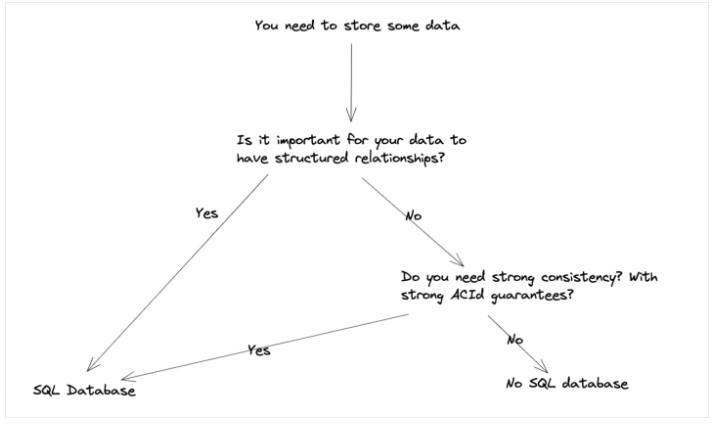

# Systems design skraceno
## SQL vs NoSQL

- Mozda oba? Amazon sa transakcijama (SQL potreban consistency) i NoSQL za proizvode
- Ok je izabrati bilo koji, razlike su obicno suptilne, samo treba obrazloziti prednosti i mane