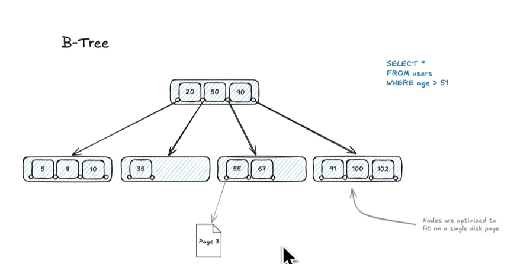

## Indexi

### B tree
Lstovi sadrze pokazivace na stranice koje sadrze podatak po tom index-u


Zgodni su jer moze lako da se radi range op. npr. `select * from users where age > 51` - lako se pretrazuje stablo jer su indexirani podaci sortirani po node-ovima
- sortiranje
- range

### Hash index-i
Rijetko se koriste u prod bazama, jer ne podrzavaju sortiranje i range op.

#### Geospatial Indices

B stabla su odlicna za jednodimezinalne podatke, nisu zgodni za **dvodimezionalne** kao geo podaci.

#### Geohashing


#### R Tree
Koristi se npr u 


### Inverted index
```
SELECT *
FROM business
WHERE name LIKE '%pizza%'
```

Da je index na `name` i query `LIKE 'pizza%'` ne bi bilo problema jer su `B-tree` sortirana. Kod Inverted index-a mapiramo svaki `name` u page na kome se nalazi, npr:
```
pizza -> page1, page7
mehanic -> page3, page 15
...
```